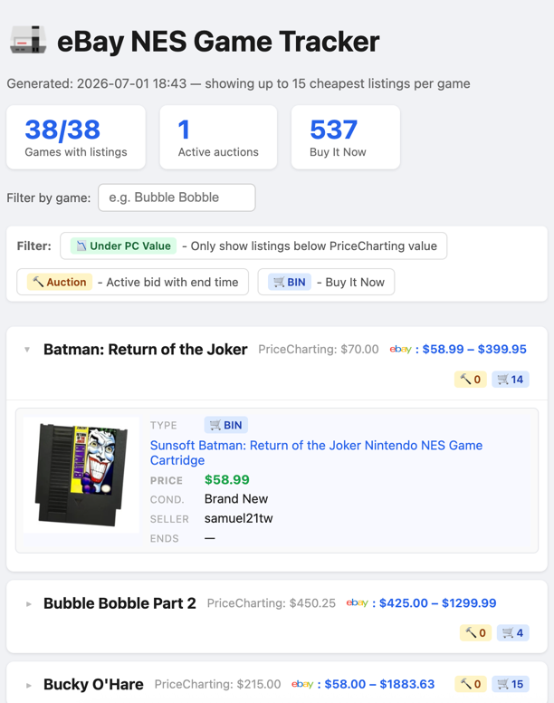

# eBay NES Game Tracker

Fetches your PriceCharting wishlist on every run, searches eBay for each game
(AUCTION + Buy It Now), stores results in SQLite, and generates a grouped HTML report.
Publishes the report to an S3 bucket, and sends push notifications about new auctions.
No hardcoded game list — the wishlist is the source of truth.

| What you get |
| --- |
|  |

## Getting an eBay API Key

### Step 1 — Create or log into your eBay account
Go to https://www.ebay.com and sign in. A regular buyer/seller account works.

### Step 2 — Join the eBay Developers Program (free)
1. Go to https://developer.ebay.com
2. Click **Join the eBay Developers Program** (top-right or center CTA)
3. Sign in with your eBay credentials and accept the license agreement
4. No credit card required

### Step 3 — Create an application keyset
1. Go to https://developer.ebay.com/my/keys
2. Click **Create a Keyset**
3. Enter any application name (e.g. `ebay-game-search`) and choose **Production**
4. Copy the **App ID (Client ID)** and **Cert ID (Client Secret)** into `.env`

> **Rate limit:** ~5,000 API calls/day (free tier, application-wide).
> With 38 games at 25 results each = 38 calls/run. Running every hour = 912 calls/day.
> You can request a limit increase via the free Application Growth Check in the Developer Dashboard.

---

## Structure

```
ebay-game-search/
├── search.py       # Entrypoint — run this
├── wishlist.py     # Fetches PriceCharting wishlist
├── ebay_client.py  # eBay Browse API + OAuth token client
├── store.py        # SQLite store (output/listings.db)
├── report.py       # HTML report generator (output/report.html)
├── .env            # API credentials (never commit)
└── output/
    ├── listings.db
    └── report.html
```

## Usage

```bash
cd ebay-game-search

# Full run: fetch wishlist → search eBay → store → report
python3 search.py

# Fetch more results per game
python3 search.py --results-per-game 50

# Regenerate report from existing DB (no API calls, no wishlist fetch)
python3 search.py --report-only
```

### Flags
| Flag | Default | Description |
|------|---------|-------------|
| `--results-per-game N` | 15 | Max eBay listings fetched per game per run |
| `--report-only` | — | Skip API calls; regenerate report from DB only |

Output → `output/report.html`

## Configuration (.env)

```
PRICECHARTING_WISHLIST_URL=https://www.pricecharting.com/wishlist?user=...

EBAY_APP_ID=...
EBAY_CERT_ID=...
EBAY_BUYER_ZIP=...   # optional; improves accuracy of CALCULATED shipping estimates
```

## Deduplication

Re-running updates price and bid count on existing listings rather than inserting
duplicates. The report shows only listings found in the **most recent run**, so stale
BIN listings that disappeared from eBay are automatically dropped.

## Scheduling (macOS/Linux — cron, ex: every 2 hours)

**Note:** cron only runs when the machine is awake.

```
0 */2 * * * cd /path/to/ebay-game-search && python3 search.py >> output/search.log 2>&1
```

(`EBAY_APP_ID`, `EBAY_CERT_ID`, and all other vars are loaded from `.env` automatically.)

## Scheduling (Windows — Task Scheduler, ex: every 2 hours)

Windows has no cron. Create a `run.bat` wrapper in the project directory:

```bat
@echo off
cd /d %~dp0
python -X utf8 search.py >> output\search.log 2>&1
```

Then register the task (adjust path to your install location):

```cmd
schtasks /create /tn "EbayGameSearch" /tr "C:\path\to\ebay-game-search\run.bat" /sc hourly /mo 2 /st 00:00 /f
```

Enable Task Scheduler history (off by default):

```cmd
wevtutil set-log Microsoft-Windows-TaskScheduler/Operational /enabled:true
```

To query or remove:

```cmd
schtasks /query /tn "EbayGameSearch"
schtasks /delete /tn "EbayGameSearch" /f
```

### Windows Requirements
Same as macOS (see Requirements section below), plus use `python` instead of `python3`.

## S3 Upload

Set `EBAY_S3_BUCKET` in `.env` to automatically upload the report after each run:

```
EBAY_S3_BUCKET=my-bucket-name
EBAY_S3_KEY=ebay-game-search/report.html   # default; change to taste
```

The uploaded object gets `Content-Type: text/html` and `Cache-Control: no-cache` so
browsers always fetch the latest. Upload uses whichever AWS credentials are already
configured (`~/.aws/credentials`, environment variables, or an IAM role).

If `EBAY_S3_BUCKET` is empty the upload step is silently skipped.

## Requirements

```
pip install requests python-dotenv boto3
```

Python 3.10+
